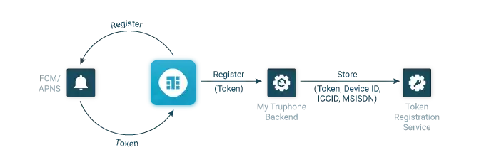
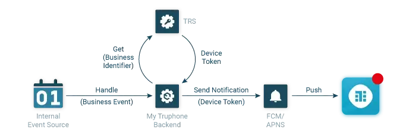


This article was originally published externally, read the original <a target="_blank" href="https://truphone.medium.com/the-journey-of-a-push-notification-ee2b1bfe833">here</a>.


Sending [push notifications](https://en.wikipedia.org/wiki/Push_technology) to a device or browser implies that, in some way, the remote server is able to initiate a conversation with the client and not the other way around. Since the typical app/client does not expose a publicly available endpoint, this is achieved by maintaining an active connection between the client and the server (e.g. a TCP socket on accept mode) that is sending the notifications. The concept is really simple but, depending on how it is implemented, may raise a variety of scalability problems. If every app on a phone were to implement it, the device’s resources would be quickly drained. Moreover, app developers would need to deal with network failures, the app going into the background and most importantly security, otherwise, such a connection could be a potential attack surface. Android and iOS solve this problem at the framework level by managing the connection themselves to Google or Apple’s push notification services, while making the functionality available to all apps on the device. Not only is this far more secure and efficient, but it also makes push notifications a breeze to implement.

## Setup

For an app to take advantage of this connection, and be able to receive push notifications, some configuration steps are required to be made. These, of course, depend on the operating system/platform, but assuming that we’re talking about android and iOS, these configurations would involve [Firebase Cloud Messaging (FCM)](https://firebase.google.com/docs/cloud-messaging/) and/or [Apple Push Notification Service (APNS)](https://developer.apple.com/library/archive/documentation/NetworkingInternet/Conceptual/RemoteNotificationsPG/APNSOverview.html#//apple_ref/doc/uid/TP40008194-CH8-SW1).

The act of receiving push notifications happens in 2 different moments: Registration and Push. The first usually happens on app boot after prompting the user for permission to send notifications, while the second is where the notifications are actually sent to the device, which could be whenever your business logic decides to. In My Truphone App, for instance, you get a push notification whenever your data plan is nearing depletion, or when your subscription is auto-renewed.

## Registration

When registering for receiving push notifications, the first step is to obtain a device token, which can be done with both the Android and iOS SDKs. The app developers should at that point store the token on the server-side, so that it can be used as a reference to the device in a different timeframe when the app will most likely be closed or running in the background. At Truphone, we built a Token Registration Service for this purpose, where the recently acquired device token is stored in association with other business logic identifiers such as the customer id, the device id, the ICCD and the different MSIDN’s associated with a Truphone eSIM profile. By having all of these associations, we can later pick up a business event and find the corresponding token, should we need to send a push notification.

<figure>
  
</figure>

## Push

Sending a notification to the device may require different implementations, according to the use case. However, the last part of the path is shared by all of them. Notifications usually start with a business event. For the My Truphone app, for example, this can be a marketing communication, a plan that has triggered the auto-renew functionality or is nearing depletion/expiration. There are a plethora of ways in that these business events can be handled but, for the sake of simplicity, let’s just assume that there is a message queuing system like ActiveMQ, RabbitMQ or Kafka that delivers all of these business events to a handler that will then process them and determine whether to send a push notification or not.

After the business event is processed and the handler has decided what it wants to say to the user, the notification is then ready to send to the device. The first step is to go back to the Token Registration Service and convert the business identifier into a push notification token. Once this is done, the notification can then be sent to FCM/APNS and then forwarded to the device. Since these are two different services with two different implementation methods, most app developers end up using a façade that provides both implementations under the same interface such as the [AWS Simple Notification Service](https://aws.amazon.com/sns/?whats-new-cards.sort-by=item.additionalFields.postDateTime&whats-new-cards.sort-order=desc), which we’ve chosen for My Truphone.

<figure>
  
</figure>

## Localisation (i18n)

While most apps don’t implement i18n, once you’ve translated your app to a different language, let’s say German, you certainly don’t want your notifications to be sent in English and vice versa. A common mistake to make at this stage is to add logic to your backend in order to determine what text will be sent to the device. Why?

- It makes your server side code more complex
- It makes it difficult to add more translations to the app because there is one additional place with text to translate
- Your server doesn’t know the phone’s language/locale

We followed [Apple’s recommendations](https://developer.apple.com/library/archive/documentation/NetworkingInternet/Conceptual/RemoteNotificationsPG/CreatingtheNotificationPayload.html) for implementing i18n and defined an id for each of the notifications. Instead of sending the text, only the notification id is sent. The actual content and translations for these notifications are bundled with the app, as well as the remaining copy. While this solves all of the 3 problems mentioned above, it makes the process less flexible, requiring the developers to release a new version if they want to add a new notification type.

The work behind sending push notifications is usually underestimated, probably due to its fairly small expression in the UI (After all it’s just a message that pops up on the user’s phone like many others). However, if you don’t plan ahead and build a solid infrastructure with a clean architecture that is able to support different use cases, you might end up with scattered bits of unmaintainable code, especially if you have a complex backend architecture where different domains can generate business events that will ultimately lead to sending a notification to the user.
