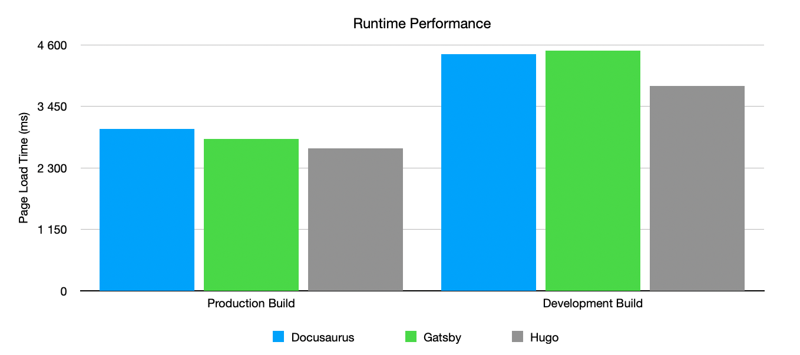

This website was recently migrated from [Docusaurus](https://docusaurus.io/) to [Hugo](https://gohugo.io/). The initial idea was to not dive into complex web development, but as I continued to produce more content and use cases, some customizations to the theme were needed, which proved to be a bit of a struggle in Docusaurus. After exploring [Gatsby](https://www.Gatsbyjs.com/) and Hugo as alternatives, I ended up sticking with the latter. In this article, I'll go through the main evaluation steps, comparing the three frameworks along the way and explain why Hugo was the final decision.

## Requirements

The main idea for this website is to share some articles and create a writing habit, but also to add custom pages like my resume or projects portfolio, without adding too much complexity to the final solution. The ideal framework needs to:

- Support **markdown** which is what I'm comfortable with as a software engineer who produces a lot of documentation;

- Provide **simple content creation** methods (adding a file to a folder will suffice), so that I can focus on the content, rather than in the code and surrounding infrastructure;

- Include **built-in themes and templates**, which would allow creating a website with boilerplate like menus, mobile compatibility without putting a lot of effort into it;

- Allow the creation of **custom pages** as well as **customizing the existing styles** and templates, so that minor adjustments can be made;

- Generate **static pages**, and **don't rely on any backend** so that the entire application can be deployed on traditional web hosting services;

This was more or less the bar set by Docusaurus although, as mentioned above, it doesn't excel at some of these points.

## The Frameworks

### Docusaurus

It was the initial choice because I was using it for API documentation at work and knew my way around it, so it seemed like a no-brainer at the time. Docusaurus is a JavaScript/Typescript static website framework, built by the Facebook team. While there isn't a specific target use case on their website, It excels at wiki style documentation, but also supports blogs, and custom pages using React or Markdown. It is the engine behind the documentation of most facebook projects as well as many others.

### Gatsby

The best way to create static websites, according to the [React documentation](https://reactjs.org/docs/create-a-new-react-app.html#Gatsby). Gatsby is around since 2015 and includes an enormous set of features. It's oriented to content driven applications (like blogs), and it includes integrations with major CMS vendors like Contentful and Wordpress. It also supports Markdown and React, but it doesn't include many prebuilt styles or themes, making it more of a web development framework than a blogging platform.

### Hugo

The oldest of the three, Hugo is a general purpose website framework like Gatsby, but it includes a large catalogue of community developed themes, as well as commercial ones, which allow the users to build a variety of applications like resume/portfolio pages, blogs, wikis, and even online stores. It supports Markdown and HTML templating but not React.

## Community and Maintenance

Good support and active maintenance are always desirable when picking up a website framework, especially if we intend to continuously evolve and maintain our project. All three of them have slightly different support models:

- Docusaurus is part of the [Meta Open Source Community](https://opensource.fb.com/) (formerly Facebook Open Source) and has over [30k stars and 900 contributors on GitHub](https://github.com/facebook/docusaurus). Having one of the world's tech giants behind it was enough to build a large community. Despite being a big opensource project, it looks like its mainly sponsored by Meta, and there aren't many community contributed plugins, themes or add-ons yet;

- Gatsby is fully open source, but it is part of an ecosystem of commercial products from [Gatsby Inc](https://www.Gatsbyjs.com/about) which supports the development, and monetizes all sorts of Gatsby related infrastructure and premium support. Their GitHub project has over [50k stars and 3k contributors](https://github.com/Gatsbyjs/Gatsby). There are also several [plugins and themes listed on their docs](https://www.Gatsbyjs.com/plugins), most of them officially supported either by Gatsby Inc or third parties;

- Hugo is a bit of an underdog in comparison to the others, but it's probably the closest to a true open-source project. It's sponsored by a couple of well known companies like [Brave](https://brave.com) and [Linode](https://www.linode.com) but there aren't obvious commercial motives behind it. There's [almost 60k stars and over 700 contributors](https://github.com/gohugoio/hugo) on GitHub, and there are a bunch of [community built themes](https://themes.gohugo.io/) as well as commercial ones. It's like the Wordpress of modern days;

## Documentation

There are two types of documentation that we typically look for: **on-boarding** and **customization/advanced** features.

On-boarding is usually the first thing we dive into when getting started with a new framework, to learn how to use the product and what features are available. All three frameworks have great on-boarding documentation, and it takes roughly 10 minutes to get started with any of them.

When it comes to customization, things are a little different. Docusaurus has a couple of [guides](https://docusaurus.io/docs/category/guides) that teach you the very basics of changing styles, replacing components and developing custom pages. Higher levels of customization usually come at the cost of navigating through the code in order to find out how it can be done.

Gatsby is by far the most complete, and this is probably it's a web development framework, and it's obviously in Gatsby Inc's interests that developers know how to work with it, so necessarily their [docs](https://www.Gatsbyjs.com/docs/) are filled with development and customization guides and example so that there is very little friction when creating a new Gatsby project.

Hugo's [docs](https://gohugo.io/documentation) are pretty much comprehensive in what comes to customization, offering all API references, components rendering strategy and some customization guides. These are also built by the community like Docusaurus, but are a bit more mature. The themes themselves also have their own docs, which are supported by the theme developer, so here it's a bit of a gamble since not all themes have good documentation.

## Customization

Still on the subject of customization, all three of them offer high levels of customization, which slightly differ from each other in terms of what can be done and difficult it is:

### Docusaurus

#### Custom Pages

Docusaurus understands any `js/ts`, `jsx/tsx` or `md/mdx` file. All of them (apart from `md`) support **React** components natively, and it is possible to do pretty much anything since you're building the page yourself. There is a [limited set of data](https://docusaurus.io/docs/docusaurus-core#hooks) available in the custom page's context, enabling stuff like reading the configuration, documents or blog posts.

#### Styling

The [Infima](https://infima.dev/) framework is shipped with Docusaurus, and all available components already have proper styles defined, which will be coherent with the design of the remaining pages. If you choose not to use Infima's building blocks, then **CSS or SASS** for these components is required, which adds a bit more work to the process. It is also possible to override global styles by providing additional stylesheets.

#### Built-in Templates

The built-in templates (docs wiki and blog, base layout etc.) are a little harder to customize, because there's just not a lot of documentation on how to do it. Each of the plugins is extensively configurable, and the React components they use can be overridden using a technique called [Swizzling](https://docusaurus.io/docs/swizzling). The plugins themselves can also be overridden, but they provide very limited guidance on how to do so.

### Gatsby

#### Custom Pages

Pretty much everything is custom in Gatsby, since it's closer to general purpose web development than to blogging. Pages can be developed in **React** using `js/ts`, `jsx/tsx` files and markdown, with the [mdx plugin](https://www.Gatsbyjs.com/plugins/Gatsby-plugin-mdx/) which enables support for `md/mdx` files. The officially supported method of loading data relies on a globally available graphql interface that enables executing to complex queries over the content and configurations.

#### Styling

The basic starter doesn't provide you with built-in styling, so it's a bit greenfield in here, pretty much like normal web development. It supports adding everything that can be used with React, and they provide [official support for a bunch of styling frameworks](https://www.Gatsbyjs.com/docs/how-to/styling/) like Theme UI, Styled Components, SASS, etc. Through the plugin mechanism, there's also support for some prebuilt/opinionated themes like [Gatsby-theme-ui-preset](https://www.Gatsbyjs.com/plugins/Gatsby-theme-ui-preset), but they don't seem to be very popular.

#### Built-in Templates

Once again, through the use of plugins it's also possible to not start from scratch, and in the case of blogging there's a [very simple starter](https://github.com/Gatsbyjs/Gatsby-starter-blog-theme), which is officially supported and can be used to start a very simple blog. It generates a new Gatsby project (or adds into an existing one) with the required files to create a ready to use blog with built-in styles and navigation.

### Hugo

#### Custom Pages

The concept of custom pages in hugo is a bit different, since every page needs to be an `md` file, making **markdown** (`mdx` is not supported, but we can use HTML inside `md` files) the only option to create content. However, pages are rendered using [Go Templates](https://gohugo.io/templates/introduction/) which basically allow writing the actual **HTML** (**no React support**) that prints the page. For each new page we can specify a different template, so it is actually pretty simple to add custom pages for whatever purpose we need.

#### Styling

Styling highly **depends on the theme** that's being used and the support it has. Because themes may contain both CSS and HTML templates, what can be done, really depends on those files. However, Hugo provides an asset bundling mechanism, which will fetch any custom **CSS or SASS** that was added to the project, and add it to the final assets bundle.

#### Built-in Templates

Hugo provides a couple of templates for simple text pages, articles and article listings, which were sufficient for the purpose of this blog. These templates are made up of a bunch of **HTML/Go Template** files and **all of them can be overridden** by mimicking the same folder structure in the current project. Themes can also contain additional templates, so basically we can [install themes](https://themes.gohugo.io/) for other purposes like, wikis, documentation pages, portfolios, stores etc..

## Performance

This is a very simple comparison of build and page load times across the three frameworks. All tests were performed on the same machine (my laptop), and the numbers are relative to its hardware specs.

Starting with build times, there are 3 different types of build that were measured: production (optimized, minified), development (source maps, uncompressed code and images. etc..) and hot reloading (like development but just for the changed files).

Notice that I changed the Y axis to logarithmic scale such is the difference between Hugo and the rest. This is likely to be related with the fact of running natively (golang) rather than in the nodejs runtime, but mostly because Hugo does much less than the other two at build time, since it doesn't need to perform all the heavy lifting required to build a React application.

The generated builds are very close to each other in terms of performance, in this case I just measured the time to load the blog listing page on all three frameworks, and the results are similar, so the Y axis has a linear scale in here.

Because Hugo's generated pages are tightly couple with the theme, this values might have been different if I were using a different theme. Nevertheless, it's possible to conclude that in terms of performance, the end result is more or less the same, but with Hugo, development cycles and iterations are much faster.

## Final Remarks

I started looking for alternatives to Docusaurus, ultimately because I wanted to move away from their theme, and customize the page layout and styles (i.e. change fonts, add a list of recent posts, etc.). While all of this is possible in Docusaurus, it's not straightforward, and definitely not well covered in the docs. I'd probably still use it for building API, SDK or open source project documentation because it is exactly what it was built for, and these are use cases where typically we're ok with standard styles and layout.

Gatsby excels where Docusaurus fails, allowing all the customization I needed and much more. It's a very complete web development framework, but on the other hand, it requires much more development effort to get something out of it (it fails were Docusaurus excels). I'd probably go with Gatsby if I wanted to build a static website with its own design, and specific functionality, from the ground up, without built-in styles and components.

Ultimately I ended up sticking with Hugo because it was the framework that offered less friction to set up the blog/webpage that I had in mind. It's obviously less flexible than Gatsby, but the component override system is really simple and well documented. Did I already mention that development cycles are blazing fast ? I'm using the [PaperMod](https://adityatelange.github.io/hugo-PaperMod/) theme, one of the most common, and while I probably won't be able to move away from these styles and dramatically change the appearance, I can override HTML templates and reuse CSS classes or add new ones, without much trouble.

If you're looking into Hugo and want to try it out, be sure to check out Nuno Coração's [getting started guide](https://nunocoracao.com/posts/202206-homepage-guide/), which is an awesome place to start playing around with it.
