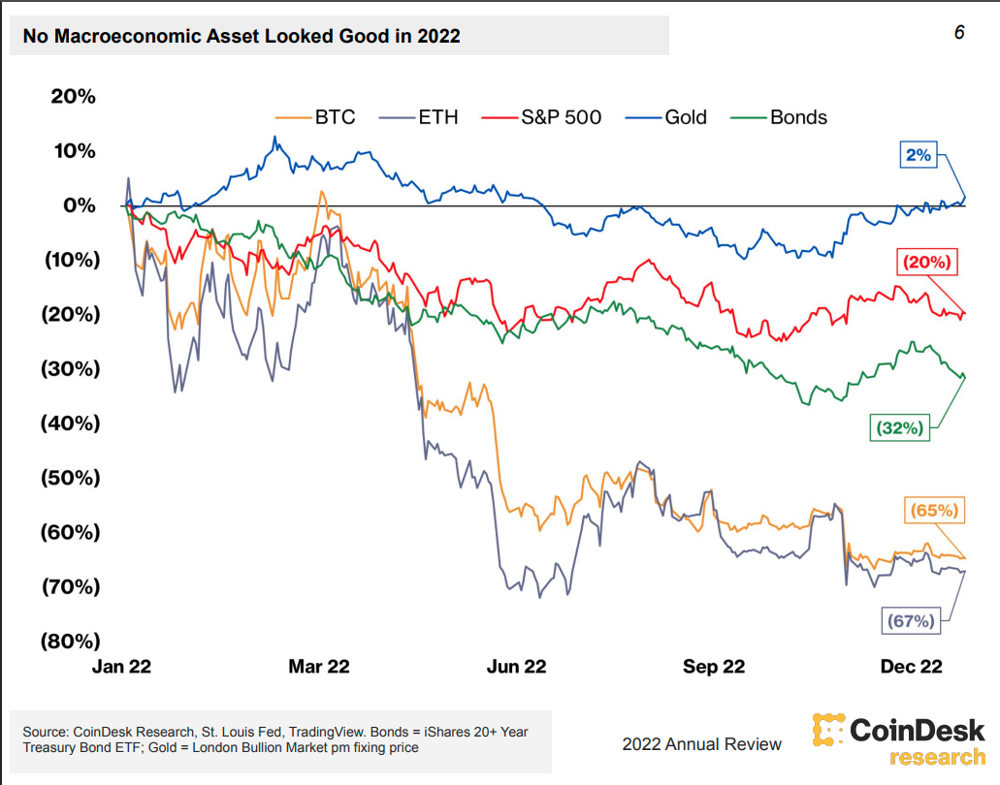
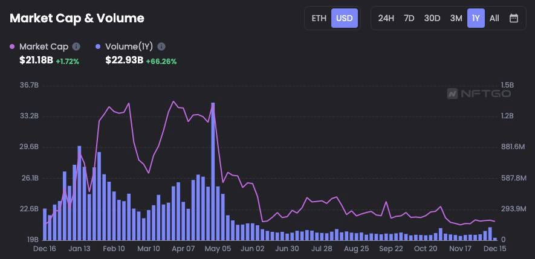

2021 ended with a series of highs in the crypto space, with both Bitcoin and Ethereum seeing major bull runs and NFTs making their way into the mainstream. However, this momentum didn’t go long into 2022. Prices came tumbling down putting an end to the speculative frenzy, hacks and bankruptcy took central stage every couple of weeks, and crypto “was dead” more than a thousand times. It was also a year of experimentation for a lot of companies in the space trying to diversify their offering in the web3 and nft space, as well as consolidation for major blockchains, which are mostly working to scale and secure the infrastructure in preparation for the future. It was a lot easier to keep up when crypto kitties were the only cool thing around 😂. Keep reading for a small digest of the most impactful events of the past year.

## Prices down

The market capitalization of crypto assets declined 62% from $2.2 trillion to about $835 billion. Other industries and asset classes also had a tough year as the world, still recovering from the downturn of the COVID-19 pandemic, was suddenly hit by the Russia-Ukraine conflict, which paved the way to a massive energy crisis and subsequent high inflation and interest rates.

NFTs also took a major hit, peaking at $35 billion in March to end the year at around $20 billion. A big loss for the majority of investors, but still an increase in total market cap when compared to early 2021

## Hacks and Collapses

### Ronin Hack

The ronin network that supports the popular Axie Infinity blockchain gaming platform became the victim of a [cryptocurrency hack](https://www.coindesk.com/tech/2022/03/29/axie-infinitys-ronin-network-suffers-625m-exploit/), one of the largest ever, which resulted in the theft of around US$625 million worth of Ethereum and the USDC stablecoin.

### Terra/Luna Crash

TerraUSD or UST (Stablecoin on Terra network) [de-pegged from the U.S. dollar](https://www.forbes.com/sites/qai/2022/09/20/what-really-happened-to-luna-crypto/) following a $2 billion worth of UST withdrawal from the [Anchor Protocol](https://www.anchorprotocol.com/), a decentralized money market on Terra. This caused a lot of panic leading people to sell their UST and thus increasing the supply of Luna due to the [algorithmic nature of this stablecoin](https://decrypt.co/resources/what-is-terra-algorithmic-stablecoin-protocol-explained). Shortly after the crash, exchanges started to delist the LUNA/UST pair, and LUNA became worthless.

Ultimately, this incident impacted several companies, among them crypto lenders Celsius, Voyager, and the Hedge Fund Three Arrows Capital (3AC), which ended up filing for bankruptcy alongside their affiliates.

[Do Kwon](https://en.wikipedia.org/wiki/Do_Kwon), Terra network’s founder fled the country and is nowhere to be found, while [Sam Bankman-Fried](https://en.wikipedia.org/wiki/Sam_Bankman-Fried) (SBF) took the opportunity to bolster his position as a major industry player, [bidding and offering lines of credit](https://www.bangkokpost.com/business/2376468/the-30-year-old-spending-1-billion-to-save-crypto) to distressed assets from the Terra-LUNA collapse.

### FTX Collapse

Throughout November, FTX, one of the largest cryptocurrency exchanges in the world was burned to the ground. The spark was a report by CoinDesk revealed Alameda Research, a quant trading firm run by SBF, held a $5 billion position in FTT, the native token of FTX, and had been borrowing millions of dollars with FTT as collateral. These documents raised concerns in the industry about the undisclosed leverage and solvency of SBF’s companies.

Binance’s CEO [Changpeng Zhao](https://en.wikipedia.org/wiki/Changpeng_Zhao) (CZ) tweeted that Binance would be [unwinding its position on FTT](https://twitter.com/cz_binance/status/1589283421704290306), which led to a panic sell across the entire market forcing FTX to pause withdrawals shortly after, causing even more chaos in the crypto market.

After Coinbase and OKX turned down SBF’s requests for bailout rescue, he turned to CZ for help but the acquisition fell apart after Binance’s due [diligence revealed](https://www.bloomberg.com/news/articles/2022-11-09/binance-seen-likely-to-balk-at-ftx-deal-after-spotting-deep-hole#xj4y7vzkg) that “there was nothing they could do to help”.

After filing for bankruptcy and stepping down as FTX’s CEO, SBF fled to the Bahamas, where he ran the business with a couple of former co-workers and colleagues from MIT. He was later arrested by the Bahamian authorities but was [released on a $250 million bond](https://www.nytimes.com/2022/12/22/business/sam-bankman-fried-ftx-bail.html) and awaits trial in the US.

## Major Brands experimenting with NFTs

Whether it is for business diversification or just fear of missing out, big companies started following each other and expanding their offering to NFTs to increase the customer base. Some of the big names included Starbucks, Instagram, Nike, Reddit, and Disney, among others. The top projects are building exclusive content and experiences on almost every type of medium, all of them seeking to diversify the offering and increase reach, pretty much like everyone started building a social media strategy 10-15 years ago. Some notorious events during the year were [Budweiser’s Superbowl Ad](https://decrypt.co/92239/bud-light-super-bowl-ad-includes-nouns-ethereum-nft-imagery) which featured a [Noun NFT](https://nouns.wtf/) and [Reddit’s collectible avatars](https://www.reddit.com/r/CollectibleAvatars/) which featured [widespread adoption](https://nftnow.com/culture/how-reddits-collectible-avatars-blew-up-the-nft-space/) across the Reddit community. [Polygon was a big winner](https://decrypt.co/115461/polygons-secret-sauce-why-starbucks-meta-reddit-chose-ethereum-scaler) by capitalizing on Ethereum’s high gas fees and the competitors’ lack of web brand experience and was able to onboard most of these brands.

## Bored Apes on Fire

The team behind [Bored Ape Yacht Club (BAYC)](https://boredapeyachtclub.com/), Yuga Labs is one of the most prominent companies in the NFT space and was all over the place in 2022. They made a big splash throughout the year with a series of events:

- [Acquisition of CryptoPunks](https://decrypt.co/94898/bored-ape-yacht-club-yuga-labs-cryptopunks-larva-labs), one of the earliest and most expensive NFT collections, (whose price wasn’t affected this year unlike everything else)
- $450 million [funding round](https://consent.yahoo.com/v2/collectConsent?sessionId=3_cc-session_0c0e5904-f64b-4597-85d0-100b76770f23) led by a16z at a $4 billion valuation;
- Launch of [ApeCoin](https://apecoin.com/), an Ethereum-based token built for supporting the evolution of gaming, art, and entertainment.
- Launch of [Otherside](https://otherside.xyz/) a metaverse game;

Mostly all of their products revolve around the Bored Ape NFTs, and due to their high value, all of those launches captured the attention of most people in the community, ultimately ending up in rises and falls of the BAYC NFT price.

## Tech Improvements

### Ethereum Merge

Ethereum recently completed [The Merge](https://ethereum.org/en/upgrades/merge/), a major upgrade that merged the original Mainnet with a separate proof-of-stake blockchain called the Beacon Chain, creating a single chain that uses proof-of-stake. The merge has reduced Ethereum's energy consumption by 99.95%.

The upgrade had been a milestone on the roadmap for a long time and took several years to build. It was heavily tested in the 3 testnets (Ropsten, Goerli, and Sepolia) and there was also a bug bounty during the entire testing phase. The actual mainnet merge was rolled out without incidents, and while it had no impact on the price and re-ignited the discussions about centralization, it was an amazing demonstration of how to prepare and coordinate critical software updates.

### Bitcoin Taproot

The [Taproot](https://cointelegraph.com/news/bitcoin-s-upcoming-taproot-upgrade-and-why-it-matters-for-the-network) update is Bitcoin’s most significant upgrade since [Segregated Witness (SegWit)](https://cointelegraph.com/explained/segwit-explained) was activated in 2017. It was designed to enhance the network’s privacy and efficiency on a larger scale by making transactions cheaper, faster, and easier to deploy. The Taproot upgrade is also expected to promote the use of smart contracts on the Bitcoin network.

### Taro Alpha Release

Lightning Network infrastructure firm Lightning Labs has released [a test version of the Taro daemon](https://github.com/lightninglabs/taro/releases/tag/v0.1.0-alpha), a new piece of software that will allow Bitcoin users to create, send and receive assets on the Bitcoin blockchain.

[Taproot Asset Representation Overlay (Taro)](https://river.com/learn/what-is-taro-in-bitcoin/) is a protocol proposed by the same company, that enables the issuing of digital assets on the bitcoin blockchain. These assets can be fungible or non-fungible, the equivalent to Ethereum’s [ERC-20](https://ethereum.org/en/developers/docs/standards/tokens/erc-20/) and [ERC-721](https://ethereum.org/en/developers/docs/standards/tokens/erc-721/), and could be sent over the bitcoin network through on-chain transactions or over lightning when deposited into a channel.

Leveraging the Taproot upgrade, Taro positions bitcoin to compete with Ethereum as the base layer for stablecoins, nfts, defi, and other kinds of decentralized apps.

### Polygon zkEVM testnets

[Zero Knowledge (ZK) Proofs](https://en.wikipedia.org/wiki/Zero-knowledge_proof) are mechanisms that allow one party to reveal knowledge of information to another party without revealing the information itself. One of their first applications used in the ZCash blockchain was to hide transaction details, but recently ZK proofs are gaining traction in the Ethereum scaling project.

In the making for over 3 years, [Polygon zkEVM](https://polygon.technology/blog/polygon-zkevm-public-testnet-the-next-chapter-for-ethereum) includes the first EVM-compatible implementation using ZK proofs, which is expected to vastly improve Ethereum’s transaction costs and speeds by allowing nodes to validate transactions by just looking at the ZK validity proof instead of replaying the smart contract execution or storing the data. It can also help to bridge the gap between off-chain data and real-world assets in crypto.

## Final notes

2022 was a tumultuous year for the crypto market, with several events that will have a lasting impact on the industry. One of the key takeaways from the year was the fragility of regulation and law enforcement in the sector. Despite increased efforts to combat crypto crime, scams, hacks, and loopholes in regulation, this year registered a record high of [$20 billion in losses](https://blog.chainalysis.com/reports/2023-crypto-crime-report-introduction/) from hacks and scams. Additionally, crypto assets were hit harder than other asset classes, revealing their high volatility. NFTs, in particular, experienced a significant downturn in prices and the community is still searching for the perfect use case, while many companies are experimenting with royalties, exclusive content, and experiences in music, art, television, and gaming. However, it wasn’t all bad news, as funding for crypto companies grew to around $30 billion, up from $23 billion in 2021. There was also notable progress in terms of technology, with the two main blockchains becoming more mature and future-proof. As we enter 2023, the speculative bubble appears to be shrinking, but this is still a trillion-dollar industry, which is why hopes and expectations for crypto’s future remain high.
