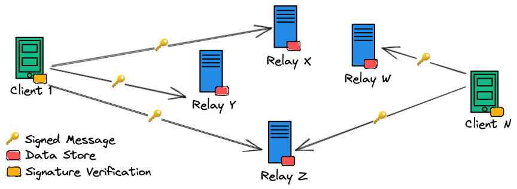
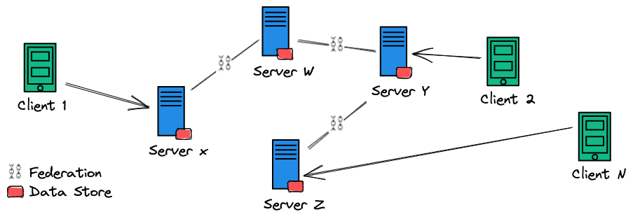
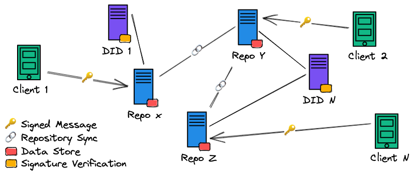
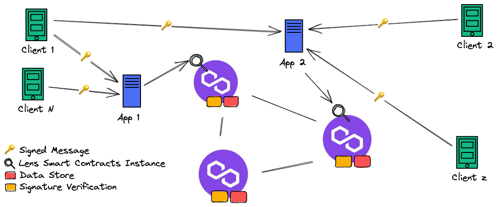

Twitter is among the biggest social media platforms ever made. Since it first went live in 2006, It went from being a strange sms-like web service with no apparent utility to one of the most popular communication tools used for pretty much everything from news and entertainment to politics and marketing. Like other internet giants, Twitter is also in the spotlight for controversy around centralization, privacy, and freedom of speech, however, its dominance in the microblogging space only seems to have increased. Several web3 and decentralized app builders are now taking over the mission to tame this [350 million-user](https://www.bankmycell.com/blog/how-many-users-does-twitter-have) beast. A bold stance, but to what extent is it possible? Do people even want it?

## Problems that need solving

All centralized platforms share the same set of problems including data breaches, censorship, privacy violations, server outages, and others. Twitter is no different and since it became one of the mainstream social media apps, there have been several controversies regarding such problems:

- Government Surveillance: [NSA requests](https://venturebeat.com/social/twitter-government-finally-letting-us-share-some-info-on-nsa-data-requests/) go back to the Snowden era, or even before. It’s no surprise that with such a large amount of data on conversations from all over the world, government agencies sought to add Twitter to their [surveillance toolkit](https://www.wionews.com/world/twiiter-files-90-reveals-a-web-of-social-media-surveillance-and-censorship-involving-fbi-and-other-agencies-546419);
- Hacks and Data Breaches: Account [hijacking](https://en.wikipedia.org/wiki/2020_Twitter_account_hijacking) is a recurring theme, and while users are the biggest attack surface, honeypots of data like Twitter and Facebook are always under fire. They're obviously highly secure, but the problem is that the attackers only need to succeed once to leak the entire user base;
- Censorship: Because they can do it, Twitter has on several occasions ‘silenced’ users by suspending or banning accounts that publish content considered harmful. Some episodes include the [Donald Trump](https://www.cnbc.com/2021/01/08/twitter-permanently-suspends-trumps-account.html) and [@elonjet](https://www.reuters.com/technology/twitter-suspends-accounts-several-journalists-2022-12-16/) bans;

Last year was one of Twitter’s most controversial years, ending with the platform being [sold to Elon Musk](https://www.bbc.com/news/technology-63402338), who believes the product and its user base are worth $44 billion. While the majority is patiently awaiting to be amused by his next move, the first months were not bright, and decentralized alternatives gained new momentum.

## [NOSTR](https://nostr.com/)

[Notes and Other Stuff transmitted by Relays](https://nostr.com/) is an [open protocol](https://github.com/nostr-protocol/nostr), that can be used for creating a decentralized, censorship-resistant social network. The idea is very simple: Each user has its own public/private key pair, signs messages, and broadcasts them to multiple relays. Relays are just dumb servers that receive and forward messages from users. They don’t talk to each other and don’t need to be trusted since the signatures are created and verified client side.

The protocol is still early days and has very few contributors but was interesting enough to have [caught Jack Dorsey’s attention](https://www.coindesk.com/tech/2022/12/15/jack-dorsey-gives-decentralized-social-network-nostr-14-btc-in-funding/). One of the most promising nostr clients is [Damus](https://damus.io/), an iOS app launched in January that looks and feels like Twitter, despite some usability issues like users being identified by their public keys.

## [Mastodon](https://joinmastodon.org/)

Social media app that also bears a striking resemblance to Twitter, but with a unique twist. The platform boasts federation capabilities thanks to the [ActivityPub](https://docs.joinmastodon.org/spec/activitypub/) protocol. This means that instead of centralizing data in one location, it is distributed among multiple server operators. Users can choose which Mastodon server to use and trust their data with, providing them with more options regarding privacy and censorship resistance. Thanks to the federation, users from different Mastodon servers can communicate with each other, creating a shared communication space akin to that of Twitter.

Mastodon has experienced a surge in popularity in 2022 due to the controversies surrounding Twitter. Despite this, it's not uncommon for Mastodon users to return to Twitter to advertise their Mastodon accounts and engage with their followers. Mastodon is a nonprofit organization that fully supports open-source, making it a unique and promising alternative to Twitter.

## [Bluesky / AT](https://atproto.com/)

Jack Dorsey has been advocating for Twitter to become a decentralized internet standard rather than a social network, [citing the platform's centralization problems](https://twitter.com/jack/status/1204766081404956674). He established Bluesky, a team tasked to work on this vision, and they came up with the [Authenticated Transfer Protocol](https://atproto.com/). The Bluesky social network, though still in private beta, will likely be its first implementation.

The protocol aims to create large-scale (Twitter-like) distributed applications, and while it is a lot more complex than this paragraph, we can strip it down to the simplest details from Mastodon and NOSTR. Users sign and publish their social behaviors (posts, comments, likes, etc.) on [signed data repositories](https://atproto.com/guides/data-repos), and are free to choose the server operator to use or host their own. Repositories can federate with each other, and users from different repositories can interact thanks to the [lexicon](https://atproto.com/guides/overview#interoperation) that includes URL schemas that identify the repository for almost every social interaction. Unlike NOSTR, in ATP, signature verification is done independently by the [DIDs](https://atproto.com/guides/identity), the protocol’s identity servers that contain the registry of user certificates.

## [Lens](https://www.lens.xyz/)

A web3 social content sharing and storage protocol that provides a backbone for developers to build decentralized apps on top of. Each user profile is an NFT, owned by a wallet that is authorized to publish content, and execute other social behaviors like comments, follows, and likes.

All data is permanently recorded on the polygon blockchain to ensure that apps have no control over it. Although everything is public and on-chain, Lens profiles are not interoperable and each app needs to have its own deployment of the lens contracts. The protocol is built and maintained by the [team behind AAVE, with Stani Kulechov](https://blockchain.news/news/aave-stani-kulechov-launches-social-media-platform-lens-protocol) as its main ambassador.

## [Minds](https://www.minds.com/)

The [whitepaper](https://cdn-assets.minds.com/front/dist/assets/whitepapers/03_27_18_Minds%20Whitepaper%20V0.1.pdf) describes Minds as a decentralized, freedom of-speech and privacy-oriented social network but it is not clear where the actual content is stored. The differentiating factor is the MINDS token, an ERC-20 utility token, issued on the Ethereum blockchain that is used to create an internal economy where, as users, we can spend MINDS to post content and boost other users’ posts (like), while also being rewarded with the token by other users who boost our posts.

## Challenges ahead

While these decentralized social media platforms have exciting features and potential, they face significant challenges in competing against established giants in the industry. Moreover, the wider public is often indifferent to their main motivation of privacy and censorship resistance, and may not be directly affected by such problems. To gain traction, these platforms need to approach and grow their audience differently. Additionally, these products are still very technical and difficult to use compared to industry standards like Twitter, Facebook, and Instagram. As most of the technology is in the early stages of development, it will take many cycles and experiments to reach the same level of maturity.

## What sets them apart

Making a mark in the space is certainly challenging, not only due to the scalability requirements but also because the industry giants are the most dominant. Social networks, however, are one good example where the problems of centralization become visible quite fast, especially when there’s government and politics in the mix. This is the differentiating factor for all of the above projects, which were built from the ground up with decentralization in mind.

- Privacy and censorship resistance: Probably not something that could be found on Twitter or Facebook’s todo list 15 years ago and now, with an enormous user base and potential for marketing/propaganda, and certainly governments chipping in, it’s more likely that they try to shift users’ attention to something else rather than fixing it;
- Full open-source: While no one can contest that all Internet giants are among the biggest open-source contributors, they still fall behind in terms of transparency when compared to platforms and protocols that are open from the get-go, and in some cases even before they were an actual product;
- Protocol first: An open ecosystem where any developer can build a different app that interoperates with the others, like email/SMTP, is the groundwork to build a diverse ecosystem with fair competition, or at least freedom of choice;
- Open to participation and DIY: A consequence of the previous two points is that anyone can participate in the network by hosting and federating their own nodes. Certainly not a feature for the average user, however an important step against centralization. Not only the data is scattered across multiple node operators, but also the users can choose which one to trust;

## What happens next

With the web yet again reinventing itself, decentralized everything is a hot topic and one that is likely to shape the future of the internet. We can’t tell if this generation of Twitter killers will succeed, and even if we get to have an internet standard for decentralized social networking, it’s not guaranteed to kill centralization. SMTP is often used as an example in this narrative, yet, with hundreds of available email service providers, [Google and Microsoft host the largest majority of email accounts in the world](https://poolp.org/posts/2019-12-15/decentralised-smtp-is-for-the-greater-good/).

One thing we can be sure of is that decentralized social networking is now more than just a few open-source projects and people are talking about it, partly fuelled by centralization problems in recent years like the [Cambridge Analytica scandal](https://en.wikipedia.org/wiki/Facebook%E2%80%93Cambridge_Analytica_data_scandal), or the [Twitter bans](https://en.wikipedia.org/wiki/Twitter_suspensions). The opportunity is there for the taking but the opponent has a $44 billion weapon and will do everything it can to stay dominant. It’s a long shot, but we’ve already seen bitcoin put the entire financial industry on edge without a roadmap and a CEO, so it’s fair to say that it can be done.

If nothing else, the protocols are already an amazing contribution and proof that decentralized social networks can be done. We can look at them as the groundwork for trustless communications over the internet, free of censorship, and open to everyone.
