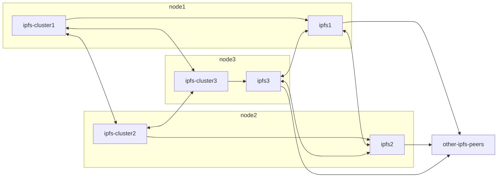
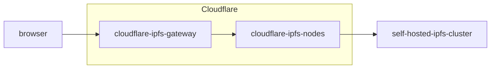

Content sharing is today's most common internet activity, made easy and accessible to everyone thanks to cloud providers, social networks, blogging platforms etc. They spoil us with cheap, reliable and highly available services, while in return we give them our data and our attention. Most of us still don't grasp to what extent these companies exploit us, but the awareness and conversation around internet centralization are growing, and the latest cryptocurrency boom brought a wave of investment and the promise to build the so-called decentralized internet or [Web3](https://blog.cloudflare.com/what-is-web3/) and bring the [control back to the users](https://blog.coinbase.com/understanding-web-3-a-user-controlled-internet-a39c21cf83f3). Web3 is not what this article is about, but it's the reason why it happened. There's a lot of excitement and people working in the web3 scene at the moment, building groundbreaking technology and products, attempting to make web3 a reality. One such example is the [Inter Planetary File System](https://ipfs.io) (IPFS) that aims to fix the problem of content addressing and streaming on a peer-to-peer network. Drawn by the hype, and curiosity, I've set myself on the journey to build an IPFS cluster - what this article is actually about - for hosting this website. Below I'll discuss the ups and downs and some interesting (or not) conclusions about the current state of website hosting on IPFS.


## Summary

- I strongly believe self-hosting is somewhere down the road to decentralization and tried to go that route;
- Soon it became obvious that full-blown self-hosting would create other complex problems and deviate myself from the original goal, so I've accepted the tradeoff of using cloud servers to run the IPFS cluster;
- DNSLink and public IPFS HTTP gateways try to bridge the gap between Web2 and Web3, and the combination is not much different from the traditional web stack, and dramatically slower;
- Cloud providers, CDNs and DNS registrars can still take my website down or at least degrade it (So much for self-hosting and decentralization);
- I ended up falling back to the traditional static website hosting on the cloud, but still offer a solution for users wanting to use their IPFS HTTP gateway or a public one, using tools like Brave or IPFS Companion;
- We need to change the way modern browsers access online content so that we're able to move away from the traditional client-server architecture to a more peer-to-peer content sharing model;

## Hosting

The whole idea behind peer-to-peer is the users' ability to share/serve their own content, which is how the internet started. If we want to be fundamentalists about it, self-hosting is the only way to have full control of our online presence. However, because I'm not a fundamentalist, and because I lack the resources to set up a reliable physical server infrastructure and network connection in my garage, I made the first tradeoff before even starting the project, and succumbed wonders of the cloud.

The idea was to set up an IPFS cluster on "my" cloud nodes, which would be used to upload/pin the website, simultaneously with [Piñata](https://www.pinata.cloud/) and [Infura](https://infura.io/) as a complementary solution to make streaming and resolution faster.

Unlike bitcoin and other blockchain based systems that replicate the whole content across the network, files on IPFS are stored in different nodes, and their address/identifier ([CID](https://docs.ipfs.io/concepts/content-addressing/)) is broadcast to a distributed hash table ([DHT](ipns://docs.ipfs.io/concepts/dht/)) that will be used to locate the content when someone tries to access it.
If there isn't at least one node in the network serving the content, it will not be available, so one good practice is to upload/pin the content to multiple nodes, which is possible due to the way [content is resolved in the IPFS network](https://docs.ipfs.io/concepts/how-ipfs-works/#distributed-hash-tables-dhts). The more nodes in the network are hosting your files, the faster it will be to find and retrieve them, and consequently, the lower will be the chances of downtime.

Though I strongly believe that self-hosting your own stuff is in the path for decentralization at some point in the future, the entry barriers presented by it are still too high, and it would take a significant effort to build the infrastructure I needed, eventually changing this project into something else. On his article about [self-hosting and decentralization](https://mccormick.cx/news/entries/on-self-hosting-and-decentralized-software) Chris McCormick states that this friction created a market for big companies like Google and Amazon to transform web hosting into a commodity, ultimately leading to internet centralization. Even most of the websites on IPFS, are (probably) hosted by Piñata and Infura, which are awesome and reliable (and probably run on AWS) but exist because it's still complicated for an average user to self-host their own contents with the same level of availability and performance established by the industry leaders.

## Building the infrastructure

Spinning up an IPFS node is quite simple, and the official docs have a [very comprehensive guide](http://docs.ipfs.io/install/server-infrastructure/#server-infrastructure). It's a good place to start, but if you're aiming towards a production environment with more than one server or component, I recommend going for one of their [supported orchestration tools](https://cluster.ipfs.io/documentation/deployment/automations) so that you can replicate configurations with confidence across multiple servers.

If I were to start over today, I'd probably use docker for the whole setup (lots of official resources available), but at that moment, my ansible chops were still fresh, and I bumped into [ansible-ipfs-cluster](https://github.com/hsanjuan/ansible-ipfs-cluster) which works quite well and was a good opportunity to make some [contributions (pending merge)](https://github.com/hsanjuan/ansible-ipfs-cluster/pull/10) to the project itself.

The `ipfs` daemon by connects to other peers in the network to serve its own content and exposes a management API both over HTTP and [libp2p](https://libp2p.io/). All of the clustering features are implemented in the [`ipfs-cluster`](https://cluster.ipfs.io) daemon which runs alongside `ipfs` and operates it using the API. `ipfs-cluster` daemons communicate between themselves (only the cluster peers) to synchronize the content across all nodes in the cluster using [RAFT or CRDT consensus](https://cluster.ipfs.io/documentation/guides/consensus).



### Exposing the website over HTTP

The IPFS network stack (libp2p) is built for peer-to-peer communication and is not compatible with HTTP at the moment. While it's still unclear whether the way we browse the web will change or not, each user would have to run an IPFS node in order to consume content from the network. This is a major dealbreaker for adoption at the moment, and because of that, IPFS ships with an [HTTP Gateway](https://docs.ipfs.io/concepts/ipfs-gateway/) to bridge the gap between traditional web2 and their network.

Companies like Cloudflare, Pinata, and many others adopting IPFS, host their public gateways to make it easy for everyone to [access files on IPFS](https://gateway.ipfs.io/ipfs/QmZ4tDuvesekSs4qM5ZBKpXiZGun7S2CYtEZRB3DYXkjGx). To make it all even more seamless, a standard called [DNSLink](https://dnslink.dev) was proposed by [Protocol Labs](https://protocol.ai), the company behind IPFS, to allow linking a DNS record to any type of content, including IPFS CIDs.

Since we can rely on public IPFS gateways, there's no need to expose an HTTP endpoint on the IPFS cluster, and therefore no need to worry about TLS certificates, caching, ddos, etc. As long as the files are stored by a node, any gateway is able to retrieve and expose them over HTTP, hiding all of this complexity from the user, and most importantly, from me.

Having said all of that, I chose Cloudflare's DNS Registrar and public IPFS Gateway (cloudflare-ipfs.com) because they have quite good [documentation](https://developers.cloudflare.com/distributed-web/ipfs-gateway) and support... and it's almost free. The image below illustrates the first setup, and it pretty much resembles a common web stack: self-hosted files, hidden behind Cloudflare.



### Deploying files to the cluster

Adding files to the IPFS nodes is fairly simple when done manually, provided that they are already available on a storage volume that the `ipfs` daemon is able to reach. There's also the webui app, which connects directly to your node's HTTP API and allows uploading files from the browser. Both are ok for experimenting and casual utilisation, but impractical for automated deployments on a CI/CD workflow like github actions, for example. One of the recommended tools is [ipfs-deploy](https://github.com/ipfs-shipyard/ipfs-deploy), an npm package that is able to pin content to several pinning services, and change the DNSLink (TXT record) using Cloudflare's API.

Getting it to work with the current setup was a different story, not because of the tool itself but because it would invalidate everything I said about not needing to expose HTTP endpoints. Up until now, the ipfs cluster's HTTP API wasn't publicly available because it wasn't needed for accessing the files. However, `ipfs-deploy` and pretty much any other ipfs deployment tool will need the IPFS cluster API to upload and pin the files. I've started with a standard approach, nginx + letsencrypt, to at least have some access control and security (Auth and TLS termination), however an [issue with go-ipfs and nginx](https://github.com/ipfs/go-ipfs/blob/master/docs/production/reverse-proxy.md), which obviously only presented itself after everything was properly setup, forced me to directly expose the cluster API using its [security features](https://cluster.ipfs.io/documentation/reference/configuration/#restapi).

The last problem down the road [was related to certbot](https://github.com/geerlingguy/ansible-role-certbot/issues/156), turns out that certbot runs as root, and if the user running `ipfs` and `ipfs-cluster` can't escalate privileges like standard nginx installations, it won't be able to use the certificates. It was solved with a good old `chmod 644`, which I'm not very proud of.

After all of this madness, the setup to host and deploy this website using IPFS was up and running, and madoke.org was available on IPFS. If you want to build something similar, I've shared the [ansible-playbook](https://github.com/madoke/ipfs-cluster-orchestration) that does all of this, hoping that it might be useful at some point in the future.

## Results

Building this infrastructure was an educative and challenging journey that helped me to better understand the whole IPFS ecosystem and how it is evolving to become the standard web3 approach to dApp and content hosting. The results however, weren't as satisfying as one would expect. Overall, the whole setup became a bit more complicated, less performant and still depending on third parties.

### Censorship Resistance

It's one of the greatest discussions in the internet, and also one of the things web3 aims to fix. In this particular setup however, the website is still vulnerable a number of external parties:

- **Cloud provider**: The first tradeoff made, to skip the hassle of building the physical server infrastructure. Consequently, if my cloud provider decides to take the IPFS cluster down, I won't be able to guarantee that the content is being served. There are some workarounds however:

  - Upload to multiple IPFS services (as discussed above), so that there is never only one source of truth, which is probably the easiest and the best approach;

  - Actually build a physical server infrastructure and serve the IPFS cluster from my garage. This one is high cost, not suitable for everybody and adds the Internet Service Provider to the parties that could interfere with the website.

- **Public IPFS Gateway**: Pretty much like with their HTTP CDN, Cloudflare can still take the website down by blocking it on their gateway. Alternatively, I could:

  - **Host my own gateway**: High cost of setting up a reliable HTTP gateway, but at least would make sure that regular web browsers can access it;

  - **Don't use a gateway at all**: This is where the mindset of IPFS wants to take the web, but unfortunately it would require everyone to run its local IPFS node to access the website, which given the current state of the web would basically lock me out of more than half of the internet users.

- **DNS**: As far as I'm able to understand, you can't easily run away from DNS registrars, so I really didn't invest any amount of time looking for alternatives. There are however starting to appear some non-ICANN registrars ([Ethereum Naming Service](https://ens.domains), [Namecoin](https://www.namecoin.org/), [Unstoppable Domains](https://unstoppabledomains.com/)), claiming to fix this problem in the blockchain, but it would probably force me to move away from `madoke.org`, which I intend to hold on for my dear life :D

### Performance

It's amazing after the content is cached on a lot of nodes, and in theory a major step towards scalability. The problem is that this is not instant, and because this website doesn't generate significant traffic, it isn't likely to become cached in a lot of nodes. After every new deployment, content resolution would take up to 5 minutes (with DNSLink adding significant more latency), until all page loads were instant.

I tried a lot of different combinations here like pinning the files not only to my nodes, but also to Piñata and Infura, [direct, explicit peering](ipns://docs.ipfs.io/how-to/peering-with-content-providers/) with Cloudflare and Piñata's nodes, but the behavior was always the same on different public gateways (Cloudflare, IPFS, Piñata).

[A couple of searches](https://discuss.ipfs.io/t/debugging-slow-content-discovery/5440) revealed that this issue is happening with more websites, and we can confirm that by installing the [IPFS Companion](https://docs.ipfs.io/install/ipfs-companion/) or [Brave](https://brave.com/) and force all IPFS enabled websites (the ones with DNSLink TXT records) to use the IPFS gateway rather than direct HTTP access. Even [docs.ipfs.io](https://docs.ipfs.io) is sometimes slow.

What everyone seems to be doing here, is not really a workaround but rather to keep giving users the traditional web2 alternative until the ecosystem has evolved to a state where it's possible to just remove it without damaging the user experience.

## Conclusions & Tradeoffs

In the end, the setup was a bit more complicated than the initial, but to be fair after the IPFS cluster is properly setup, you don't need to touch it anymore, so I've decided to continue to make the website available on IPFS, but without dropping the static hosting on cloudflare. Thanks to github actions, this happens seamlessly after every commit. Users with [Brave](https://brave.com/) or [IPFS Companion](ipns://docs.ipfs.io/install/ipfs-companion/) can use their own IPFS node/gateway to access the site if they want. This is possible because adding the DNSLink TXT record to `madoke.org` will make those tools prompt the user if they want to navigate using IPFS.

```bash
> dig +short TXT _dnslink.madoke.org
"dnslink=/ipfs/QmbKyCXSYiJPQdvB5Z2MEBNGfjTbTfAA9x4THsS1PSLcPX"
```

As to the public gateway, I've decided to drop it because the website is still being served on Cloudflare Pages, and not only the idea of a centralized gateway is pretty much the same, but it also goes against the web3, and IPFS's own principles.
The [problem with public gateways](https://medium.com/pinata/the-ipfs-gateway-problem-64bbe7eb8170), as exposed by [Matt Ober](https://www.linkedin.com/in/matt-ober/), is that they were built to bridge the gap to web2, but they are fundamentally incompatible with distributed, peer to peer systems.

All in all, `madoke.org` can't be exclusively on IPFS for now, so let's just say that it is also available on IPFS rather than migrated, which was the original goal. It was a very interesting project that taught me a lot about IPFS, and made me understand that in order to truly benefit from peer to peer and distributed file sharing protocols, the tools that we for browsing the internet need to change their approach, but most importantly adopt these standards so that technologies like IPFS can be accessible to the average user.
